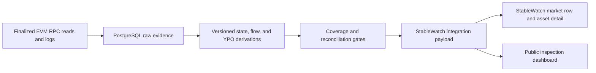

# StableWatch integration handoff

## What is ready

The service exposes one versioned StableWatch projection plus three supporting
read-only evidence endpoints:

`GET /api/v1/stablewatch/assets/parallel-usdp-susdp`

`GET /api/analytics/usdp-supply`

`GET /api/analytics/range?range=7d&chains=base&assets=usdp,susdp`

`GET /api/analytics/history`

Production base URL: <https://content-spirit-production-5efa.up.railway.app>

The endpoint is intentionally shaped around StableWatch concepts rather than
the indexer's internal tables. It can populate a market row, a USDp/sUSDp asset
detail, a five-chain breakdown, per-chain seven-day Yield Paid Out, and a trust
panel. The contract is documented in
[`docs/openapi/stablewatch-integration.v1.yaml`](openapi/stablewatch-integration.v1.yaml).

## Field mapping

| StableWatch concept  | Integration field           | Current definition                                                             |
| -------------------- | --------------------------- | ------------------------------------------------------------------------------ |
| Asset                | `marketRow.asset`           | sUSDp                                                                          |
| Protocol             | `marketRow.protocol`        | Parallel V3                                                                    |
| TVL                  | `marketRow.tvlUsdp`         | Sum of ERC-4626 `totalAssets()` across the five official sUSDp chains          |
| TVL in USD           | `marketRow.tvlUsdEstimate`  | TVL multiplied by the attributed USDp/USD source; remains candidate            |
| APY                  | `marketRow.estimatedApy`    | TVL-weighted onchain estimated APY; never described as trailing realized APY   |
| 7d YPO               | `marketRow.ypoSevenDay`     | Available only when all five aligned chain windows are complete and reconciled |
| 30d/90d/all-time YPO | matching `marketRow` fields | Explicitly unavailable until those windows are indexed                         |
| Chain detail         | `detail.chainBreakdown`     | Finalized block, vault state, share price, estimated APY, and history state    |
| Trust                | `trust`                     | Freshness, expected/included/missing chains, versions, and source registry     |
| Global USDp supply   | `detail.usdpSupply.global`  | Aligned 24-chain sum, candidate until bridge reconciliation promotes it        |

The range endpoint supports `7d`, `30d`, `90d`, `all`, or explicit `from` and
`to` timestamps. It returns transfer/mint/burn activity, holder counts,
ERC-4626 deposits/withdrawals, and YPO only when the complete requested history
is proven. Missing long-window data remains a typed unavailable component.

Lending-only concepts such as borrowers, borrows, repays, and liquidations are
listed under `nonApplicableMetrics`. They are not native issuer/savings-vault
metrics and are not filled with zeros.

## Numeric and status contract

All blockchain integers are decimal strings. USDp and sUSDp use 18 base-unit
decimals. `fixed_18` is a dimensionless fixed-point number; for example,
`50000000000000000` means 5%. Consumers must not coerce these values through a
JavaScript `number` before decimal scaling.

Every headline metric has two independent axes:

- `availability`: `available`, `stale`, or `unavailable`;
- `verification`: `verified`, `candidate`, or `not_applicable`.

This prevents a present value from silently implying that its methodology is
final. An unavailable value is `null` and includes a machine-readable reason.
The five-chain current savings snapshot remains candidate pending owner review;
the aligned seven-day YPO is verified because all five component intervals are
gap-free and independently reconciled. A historical global total is promoted
to verified only after those coverage and reconciliation gates pass.

## Data flow and ownership

The API is a projection over durable evidence. It does not call providers on
request, trigger a backfill, or mutate data. Provider credentials remain
server-side Railway variables and are never part of the response.

## Integration checks

1. Fetch the endpoint and require
   `schemaVersion === "parallel-stablewatch-asset-v1"`.
2. Render only metrics with `availability === "available"`; mark `stale`
   separately and preserve `unavailable` reasons.
3. Display verification badges independently from availability.
4. Scale values according to `unit`; do not assume every integer is USD.
5. Preserve `trust`, block provenance, calculation versions, and source links
   in an expandable methodology surface.
6. Treat additions as backward-compatible within v1; a breaking field or unit
   change requires a new route/version.
7. Run `npm run reviewer:proof` to validate the public deployment and the
   critical projection invariants in one command.

## Known boundaries at handoff

- Five-chain current sUSDp state is implemented.
- The aligned seven-day history is complete across Ethereum, Base, Sonic,
  HyperEVM, and Avalanche. The verified global native YPO is
  `567518330008086395152` USDp base units for the pinned window ending
  `2026-07-16T00:59:17Z`.
- All 24 USDp deployments now have aligned current `totalSupply`, bytecode, and
  metadata evidence. The summed value is available as a candidate; it is not
  promoted to verified circulating supply until LayerZero bridge topology and
  message reconciliation pass.
- The attributed USD price is currently a DIA observation from HyperEVM. The
  response labels this as candidate cross-chain attribution.
- The range API serves lifetime activity on Ethereum, Base, Sonic, and
  Avalanche. Long-window YPO and aligned TVL/APY series remain
  unavailable until exact boundary intervals exist; they are not synthesized.

## Repository verification

Run `npm run check` before release. This covers the secret scan, formatting,
lint, type checking, unit/fixture tests, and a production Next.js build. The
public dashboard and integration route use the same pure payload builder, so
their status and metric semantics cannot drift independently.
